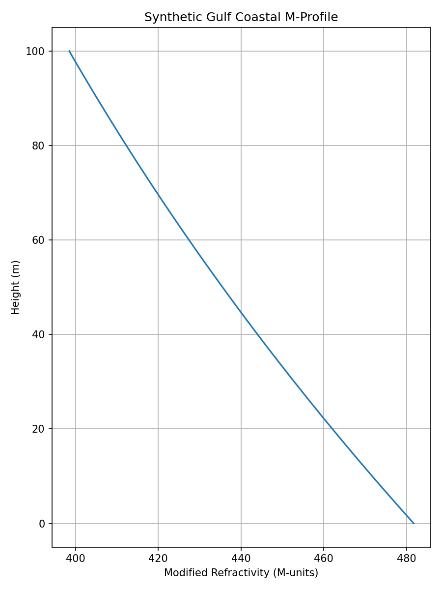
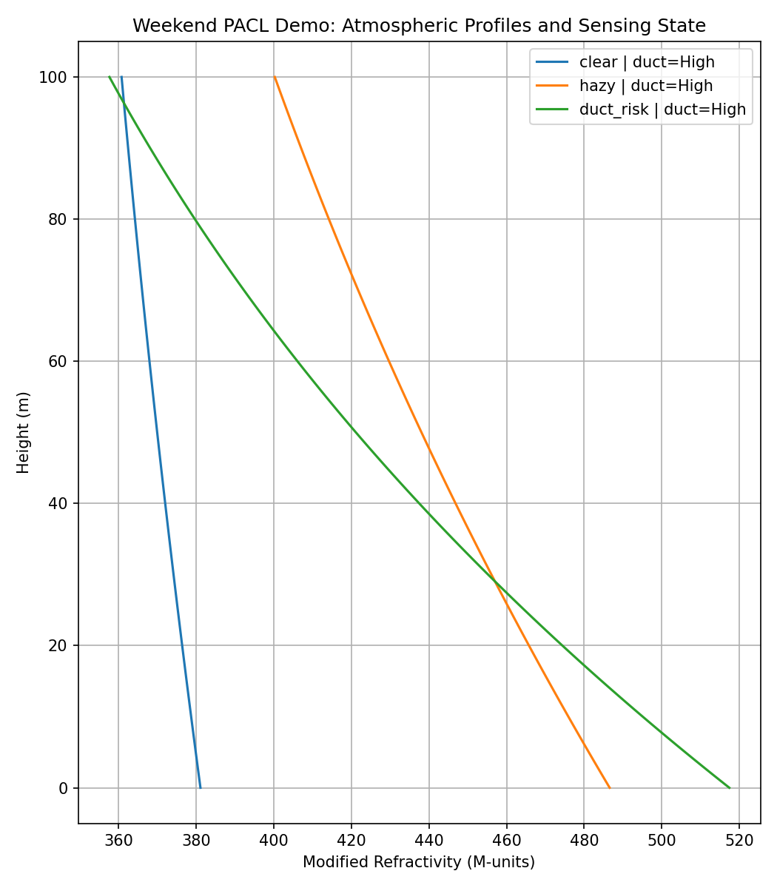
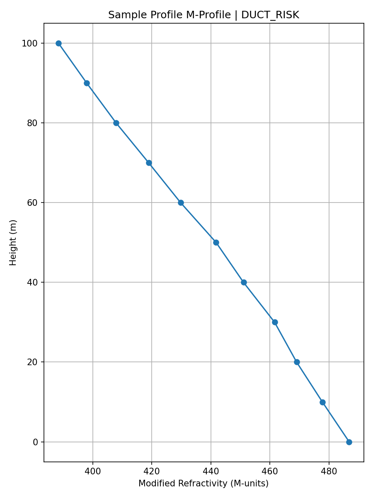

# PACL Gulf Atmosphere

PACL Gulf Atmosphere is the first public research artifact for PACL
(Atmospheric-Aware Sensing and Tracking in Gulf Coastal Environments).

## Scope

This repository focuses on Layer 1 of PACL:

- Gulf coastal atmospheric modeling
- modified refractivity (M-profile) computation
- short-horizon environmental prediction baselines
- visual analysis of ducting and degraded-environment sensing conditions

## Initial Goal

Build a small, credible research artifact showing:

1. how Gulf atmospheric variables can be converted into M-profiles
2. how duct-like conditions can be visualized
3. how atmospheric state can inform degraded-environment sensing research

## Structure

- `data/raw/` raw atmospheric input files
- `data/processed/` processed analysis files
- `src/` source code
- `notebooks/` exploratory analysis
- `docs/` short project notes

## Status

Early-stage research repository.
## Example Output

Synthetic Gulf M-profile:

Weekend PACL demo:

CSV-driven profile result:

